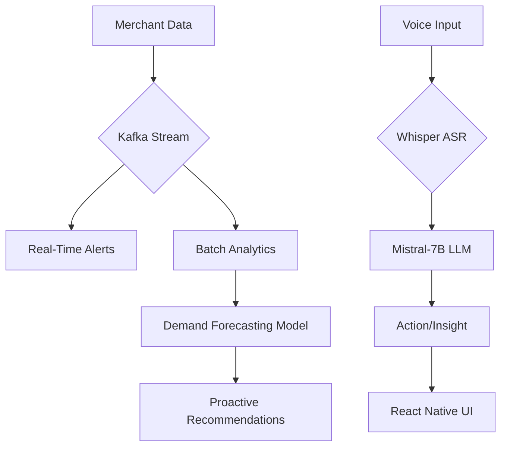

# Chat-Based AI Assistant: Grablet 
## 1. Solution Overview
### Objective
Empower Grab merchant-partners with a proactive, voice-first AI assistant that delivers real-time insights, automates workflows, and bridges language/digital literacy gaps in Southeast Asia.

### Key Features (TODO)
- **Proactive Alerts**: Low-stock warnings, demand spikes, and competitor benchmarks.
- **Voice-Driven Workflows**: Dialect-aware speech-to-text for multiple language.
- **Predictive Insights**: AI-driven demand forecasting and pricing optimization.
- **Auto-Actions**: One-tap restocking, promo creation, and supplier coordination.

---

## 2. Architecture (TODO)


### Components
- **Data Pipeline**: ...

---

## 3. Data Utilization & Personalization (TODO)
### Data Used
We utilize the following datasets to provide personalized, data-driven recommendations and insights for merchant-partners:

- **Transaction Data**: Used to analyze sales trends, calculate earnings, and determine peak business hours.
- **Transaction Items**: Enables identification of top-selling products, low-performing items, and customer preferences.
- **Merchant Data**: Supports personalized suggestions based on business type, size, location, and maturity level.
- **Items Metadata**: Helps detect underperforming items, manage inventory, and identify trending products.
- **Keywords**: Enhances searchability, trend detection, and product discovery through natural language analysis.

### Personalization Features

- Custom insights tailored to each merchant's business characteristics and performance metrics.
- Adaptive responses that consider merchant behavior, sales history, and inventory patterns.
- Recommendations for improving item conversion, adding trending items, or revising underperforming products.
- Multilingual support (English, Malay, Chinese) and localized feedback.
- Voice input support using Whisper API for more intuitive communication.

### Achieved Enhancements

We’ve successfully implemented several planned future features, including:

- ✅ Real-time analytics and summary of key metrics (e.g., earnings, top items, peak hours)
- ✅ Personalized AI-driven advice for business improvement
- ✅ Multilingual, chat-based interaction with voice support
- ✅ Identification of business opportunities like "popular but unbought" items
- ✅ Item recommendation system based on keyword trends and merchant type

---

## 4. Technical Execution
### AI/ML Models

| Model               | Tech Stack                | Metric / Purpose                                      |
|---------------------|---------------------------|--------------------------------------------------------|
| GPT-3.5 (OpenAI API) | Python, OpenAI API        | Multilingual chat-based assistant                     |
| Whisper             | Python, Whisper API       | Transcribe voice to text for voice input              |
| Custom Analytics    | Pandas, NumPy             | Revenue, order volume, basket size, delivery time     |
| Recommendation Logic| Scikit-learn, pandas      | Personalized item suggestions & underperforming items |

---

## 5. Business Model
### Scalability Roadmap

---

## 6. Future Roadmap

---

## 7. User Flow Diagram

```mermaid
graph TD
    A[Launch Grablet App] --> B{Input Type?}
    B -->|Voice| C[Voice captured via mic]
    C --> D[Whisper transcribes voice to text]
    B -->|Text| E[Typed message entered]
    D --> F[Send query to GPT-3.5]
    E --> F
    F --> G[Intent recognized]
    G --> H{Need analytics?}
    H -->|Yes| I[Query transaction & merchant data]
    I --> J[Generate insights / response]
    H -->|No| J
    J --> K[Detect preferred language]
    K --> L[Translate & return insight in selected language]
    L --> M[Display in Chat UI]


