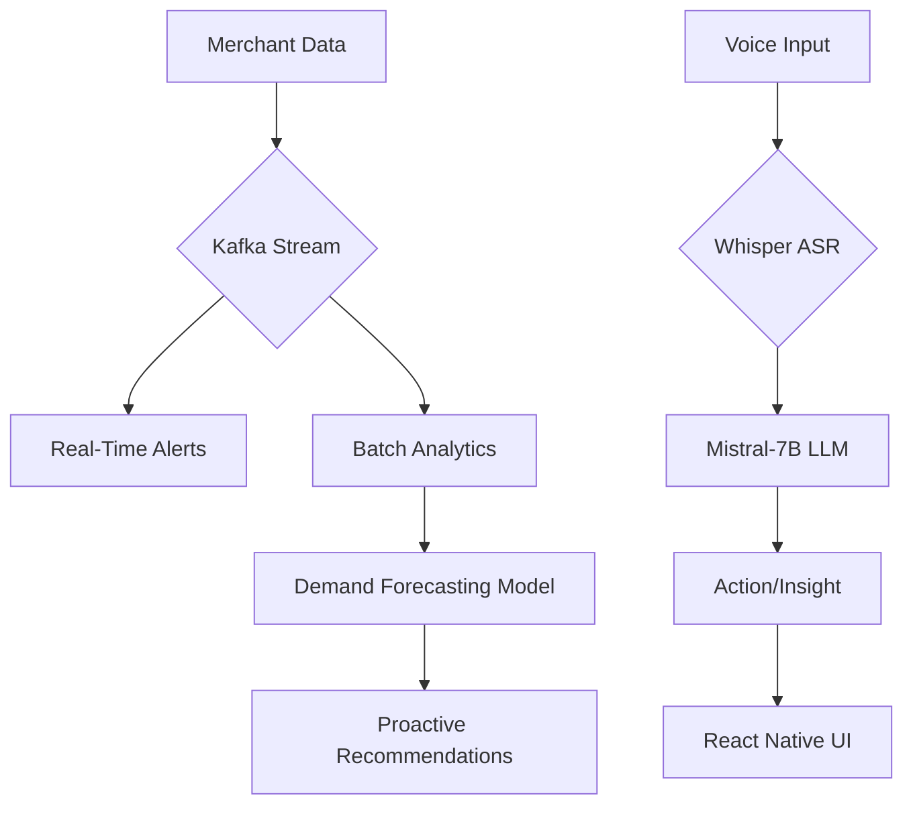

# Chat-Based AI Assistant: Grablet 
## 1. Solution Overview
### Objective
Empower Grab merchant-partners with a proactive, voice-first AI assistant that delivers real-time insights, automates workflows, and bridges language/digital literacy gaps in Southeast Asia.

### Key Features (TODO)
- **Proactive Alerts**: Low-stock warnings, demand spikes, and competitor benchmarks.
- **Voice-Driven Workflows**: Dialect-aware speech-to-text for English, Chinese and Malay.
- **Predictive Insights**: AI-driven demand forecasting and pricing optimization.
- **Auto-Actions**: One-tap restocking, promo creation, and supplier coordination.

---

## 2. Architecture (TODO)

### Components
- **Data Pipeline**: ...

---

## 3. Data Utilization & Personalization (TODO)
### Data Used
describtion of using data

---

## 4. Technical Execution
### AI/ML Models
(table description with column 'Model', 'Tech Stack', 'Metric?')
---

## 5. Business Model
### Scalability Roadmap

---

## 6. Future Roadmap
