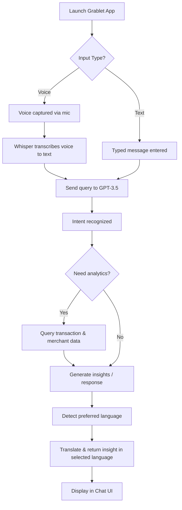

# Chat-Based AI Assistant: Grablet 
## 1. Solution Overview
### Objective
Empower Grab merchant-partners with a proactive, voice-first AI assistant that delivers real-time insights, automates workflows, and bridges language/digital literacy gaps in Southeast Asia.

### Key Features
- **Voice-First Design**:
  - Integrated speech-to-text (Whisper API) and text-to-speech (ElevenLabs/OpenAI) for a hands-free chatbot experience.
  - Multilingual support: English, Malay, and Chinese (prototype) — scalable to other Southeast Asian languages.
- **Real-Time Sales Analytics**:
  - **Smart Sales Dashboard**:
    - Visualizes daily, weekly, and monthly performance
    - Highlights top-selling items, peak hours, and predicts upcoming sales trends using Prophet
  - **Streamlined Inventory**:
    - Auto real-time low-stock detection and alert with restock suggestions
- **AI-Driven Insights**
  - **Business Advice Engine**:
    - Combines GPT-3.5 with a custom Retrieval-Augmented Generation(RAG) system to generate contextual insights from transactional data
  - **Competitive Leaderboards**:
    - Ranks merchants by sales/ratings across different scopes (Overall, Nearby, Category)
- **Accessibility Design**:
  - **Low-Literacy Optimization**:
    - Clear visuals, data-driven charts
    - Simple one-tap actions for smooth interaction
- **Feedback-Driven Learning**:
  - User can rate AI responses as "Good" or "Bad" with a single tap
  - Feedback is used to fine-tune future suggestions, making the system more personalized, reliable, and aligned with merchant needs

---

## 2. System Architecture

---

## 3. Data Utilization & Personalization
### Data Used
We utilize the following datasets to provide personalized, data-driven recommendations and insights for merchant-partners:

- **Transaction Data**: Used to analyze sales trends, calculate earnings, and determine peak business hours.
- **Transaction Items**: Enables identification of top-selling products, low-performing items, and customer preferences.
- **Merchant Data**: Supports personalized suggestions based on business type, size, location, and maturity level.
- **Items Metadata**: Helps detect underperforming items, manage inventory, and identify trending products.
- **Keywords**: Enhances searchability, trend detection, and product discovery through natural language analysis.

### Personalization Features

- Custom insights tailored to each merchant's business characteristics and performance metrics.
- Adaptive responses that consider merchant behavior, sales history, and inventory patterns.
- Recommendations for improving item conversion, adding trending items, or revising underperforming products.
- Multilingual support (English, Malay, Chinese) and localized feedback.
- Voice input support using Whisper API for more intuitive communication.

### Achieved Enhancements

We’ve successfully implemented several planned future features, including:

- ✅ Real-time analytics and summary of key metrics (e.g., earnings, top items, peak hours)
- ✅ Personalized AI-driven advice for business improvement
- ✅ Multilingual, chat-based interaction with voice support
- ✅ Identification of business opportunities like "popular but unbought" items
- ✅ Item recommendation system based on keyword trends and merchant type

---

## 4. Technical Execution
### Technology Stack

| Component                    | Technology/Tools                      | Metric / Purpose                                      |
|------------------------------|---------------------------------------|-------------------------------------------------------|
| Backend                      | FastAPI, Python	REST API development | data processing, and integration with AI models       |
| Frontend                     | React Native, JavaScript              | Cross-platform mobile app development for iOS/Android |

### AI/ML Models

| Model                        | Tech Stack                | Metric / Purpose                                      |
|------------------------------|---------------------------|-------------------------------------------------------|
| GPT-3.5 (OpenAI API)         | Python, OpenAI API        | Multilingual chat-based assistant                     |
| Whisper (STT)                | Python, Whisper API       | Transcribe voice to text for voice input              |
| OpenAI TTS                   | Python, OpenAI API        | TTS for broader language support                      |
| ElevenLabs (TTS)             | Python, ElevenLabs API    | Text-to-speech for Malay audio responses              |
| Custom Analytics             | Pandas, NumPy             | Revenue, order volume, basket size, delivery time     |
| Recommendation Logic         | Scikit-learn, pandas      | Personalized item suggestions & underperforming items |
| Advice Engine                | Python, GPT-3.5, RAG      | Provide personalized advice based on merchant's data  |
| Time Series Sales Forecasting| Python, Prophet           | Predict future daily sales for merchants              |

---

## 5. Business Model

We have identified three key business model strategies to monetize the merchant assistant while delivering strong operational value. Each strategy is designed to drive revenue, increase merchant engagement, and deepen ecosystem integration.

### In-App Ingredient Restock with GrabMart 🛒

- Transforms the assistant into a revenue-generating channel by enabling direct ingredient restocking when low inventory is detected.
- Orders are fulfilled via GrabMart, driving traffic and transactions within Grab’s own ecosystem instead of external suppliers.
- Builds merchant reliance on the assistant for daily operations, increasing stickiness and platform retention.
- Converts operational utility into long-term business value by embedding GrabMart as a core part of the merchant’s workflow.

### Premium Subscription Tier 🌟

- Provides basic features for free to drive adoption, then encourages upgrades by locking high-value features behind a premium paywall.
- Premium includes personalized insights, unlimited assistant usage, and forecasting tools—essential for serious merchants to optimize operations.
- This tiered model balances reach and monetization, ensuring wide user acquisition while capturing revenue from power users.
- Increases merchant lifetime value (LTV) as they grow and transition from freemium to premium based on evolving needs.

### Transaction-Based Commission Model 💰

- Generates revenue by taking a small commission on every restock order placed through the assistant.
- Monetization is directly tied to merchant activity, creating a scalable and performance-based income stream.
- The model is non-intrusive—merchants benefit from convenience while Grab earns passively in the background.
- Increased merchant engagement directly fuels revenue growth, creating a flywheel effect where the assistant’s usefulness drives adoption, and adoption drives monetization.

---

## 6. Future Improvement
- **AI & Prediction Enhancements**:
  - Replace Prophet with deep learning model such as Long Short-Term Memory(LSTM) to better capture complex patterns in merchant's transaction data
- **Language Expansion**:
  - Support more Southeast Asian languages, dialects and slangs
- **Promo Effectiveness Prediction**:
  - Use past transaction data to predict how effective a promotion or discount will be, estimating potential sales lift, ideal timing, and target audience to maximize ROI
- **Stock-Level Integration with Auto-Restock Suggestion**:
  - Monitor real-time stock levels and suggest restocks based on sales velocity and supplier lead time, which help merchants stay ahead of demand with minimal effort.
---

## 7. User Flow Diagram

