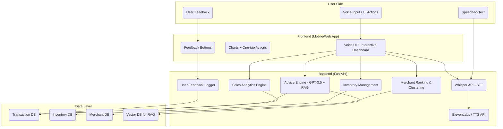
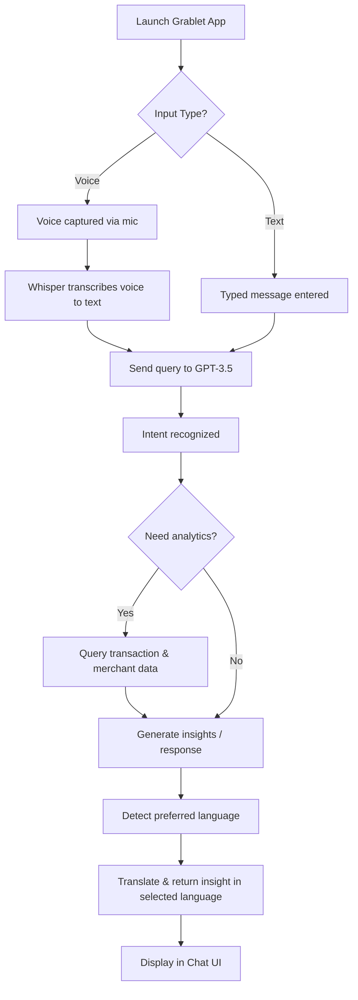

# Chat-Based AI Assistant: Grablet 
## 1. Solution Overview
### Objective
Empower Grab merchant-partners with a proactive, voice-first AI assistant that delivers real-time insights, automates workflows, and bridges language/digital literacy gaps in Southeast Asia.

### Key Features (TODO)
- **Voice-First Design**:
  - Integrated speech-to-text (Whisper API) and text-to-speech (ElevenLabs/OpenAI) for a hands-free chatbot experience.
  - Multilingual support: English, Malay, and Chinese (prototype) — scalable to other Southeast Asian languages.
- **Real-Time Business Analytics**:
  - **Smart Sales Dashboard**:
    - Visualizes daily, weekly, and monthly performance
    - Highlights top-selling items, peak hours, and predicts upcoming sales trends
  - **Intelligent Inventory Management**:
    - Auto low-stock detection with restock suggestions
    - Potential auto-supplier ordering (?)
- **AI-Driven Insights**
  - **Business Advice Engine**:
    - Combines GPT-3.5 with a custom Retrieval-Augmented Generation(RAG) system to generate contextual insights from transactional data
  - **Competitive Leaderboards**:
    - Ranks merchants by sales/ratings across different scopes (Overall, Nearby, Category)
- **Accessibility Design**:
  - **Low-Literacy Optimization**:
    - Clear visuals, data-driven charts
    - Simple one-tap actions for smooth interaction
- **Feedback-Driven Learning**:
  - User can rate AI responses as "Good" or "Bad" with a single tap
  - Feedback is used to fine-tune future suggestions, making the system more personalized, reliable, and aligned with merchant needs

---

## 2. System Architecture (edit the datapart into csv filenames and link correctly)

---

## 3. Data Utilization & Personalization (TODO)
### Data Used
We utilize the following datasets to provide personalized, data-driven recommendations and insights for merchant-partners:

- **Transaction Data**: Used to analyze sales trends, calculate earnings, and determine peak business hours.
- **Transaction Items**: Enables identification of top-selling products, low-performing items, and customer preferences.
- **Merchant Data**: Supports personalized suggestions based on business type, size, location, and maturity level.
- **Items Metadata**: Helps detect underperforming items, manage inventory, and identify trending products.
- **Keywords**: Enhances searchability, trend detection, and product discovery through natural language analysis.

### Personalization Features

- Custom insights tailored to each merchant's business characteristics and performance metrics.
- Adaptive responses that consider merchant behavior, sales history, and inventory patterns.
- Recommendations for improving item conversion, adding trending items, or revising underperforming products.
- Multilingual support (English, Malay, Chinese) and localized feedback.
- Voice input support using Whisper API for more intuitive communication.

### Achieved Enhancements

We’ve successfully implemented several planned future features, including:

- ✅ Real-time analytics and summary of key metrics (e.g., earnings, top items, peak hours)
- ✅ Personalized AI-driven advice for business improvement
- ✅ Multilingual, chat-based interaction with voice support
- ✅ Identification of business opportunities like "popular but unbought" items
- ✅ Item recommendation system based on keyword trends and merchant type

---

## 4. Technical Execution
### AI/ML Models

| Model               | Tech Stack                | Metric / Purpose                                      |
|---------------------|---------------------------|-------------------------------------------------------|
| GPT-3.5 (OpenAI API)| Python, OpenAI API        | Multilingual chat-based assistant                     |
| Whisper             | Python, Whisper API       | Transcribe voice to text for voice input              |
| ElevenLabs (TTS API)| Python, ElevenLabs API    | Text-to-speech for audio responses                    |
| Custom Analytics    | Pandas, NumPy             | Revenue, order volume, basket size, delivery time     |
| Recommendation Logic| Scikit-learn, pandas      | Personalized item suggestions & underperforming items |
| Advice Engine       | Python, GPT-3.5, RAG      | Provide personalized advice based on merchant's data  |

---

## 5. Business Model

### For Grab Merchants

#### 1. Profit Optimization 💰
- Enables revenue growth by providing merchants with AI-driven insights into daily sales trends, top-performing products, and region-specific demand patterns.
- Minimizes operational losses with predictive inventory alerts and automated tracking, crucial for managing fast-moving goods in dynamic, localized markets.
- Facilitates margin improvements by recommending pricing strategies and sales actions aligned with local customer behavior and seasonal trends.

#### 2. Competitive Edge 🏆
- Offers real-time benchmarking with nearby and similar-category businesses, helping merchants understand their standing in highly competitive, fragmented markets.
- Delivers adaptive recommendations tailored to merchant types, regional preferences, and maturity stages—essential in Southeast Asia's highly diverse and segmented merchant landscape.
- Equips merchants with data-backed strategies to capitalize on local events, customer preferences, and competitor trends.

#### 3. Accessible Intelligence 🧠
- Supports seamless communication in major Southeast Asian languages (English, Malay, Chinese, etc.), reducing friction for non-English speaking merchants.
- Empowers merchants with voice message input and AI-generated audio replies, supporting users across varying levels of digital and traditional literacy.
- Ensures inclusive access to business intelligence with a simple, intuitive chat interface usable by both tech-savvy and first-time digital entrepreneurs.

### For Grab (The Company)

#### 1. Revenue Growth Engine 🚀
- Drives increased Gross Merchandise Value (GMV) by empowering merchants to sell more efficiently and adapt faster to market needs, resulting in more transactions across Grab’s ecosystem.
- Unlocks new monetization streams through value-added AI features, premium analytics, and merchant-focused advertising or promotions.
- Encourages broader adoption of Grab’s services by deepening merchants’ reliance on the platform for end-to-end business operations.

#### 2. Merchant Retention & Platform Loyalty 🤝
- Strengthens platform loyalty by embedding AI as a daily operational tool, making Grab indispensable to micro and SME merchants across the region.
- Improves merchant satisfaction and engagement through personalized, proactive support that adapts to local markets and individual business trajectories.
- Enables long-term retention through continuous learning from merchant feedback, fostering trust and sustained usage.

#### 3. Smart Operations Platform 🤖
- Significantly reduces support costs by replacing routine inquiries with automated AI responses, which scale across multiple languages and regions.
- Enhances service consistency across Southeast Asia, ensuring merchants receive accurate, localized assistance without the need for large regional support teams.
- Creates operational agility by freeing up human support resources to focus on merchant onboarding, training, and strategic growth partnerships.

---

## 6. Future Roadmap
- 

---

## 7. User Flow Diagram

