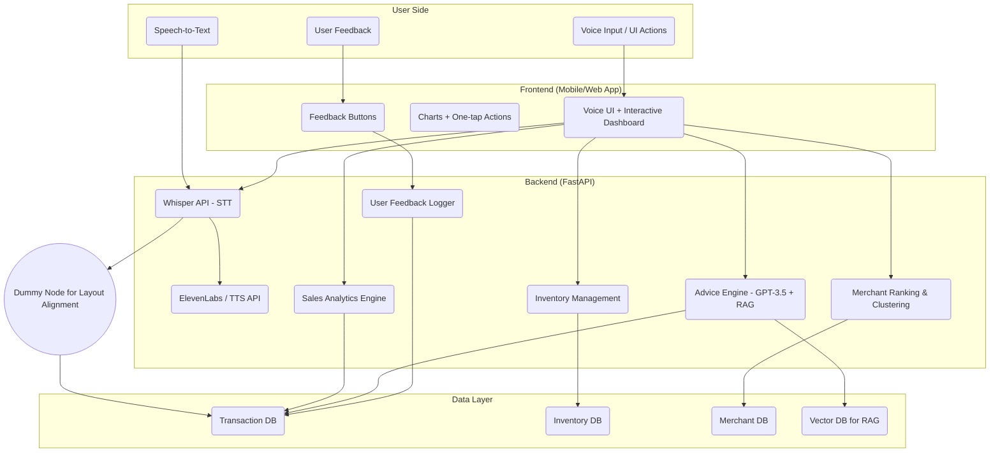
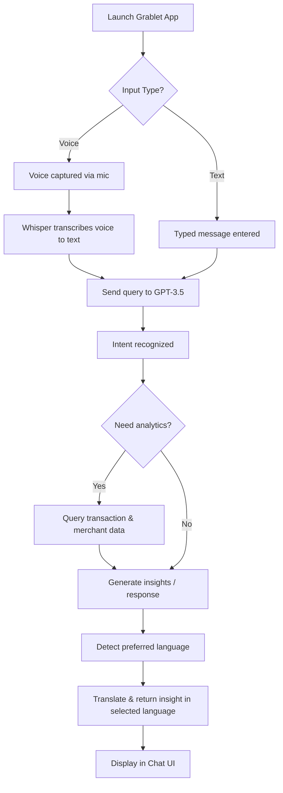

# Chat-Based AI Assistant: Grablet 
## 1. Solution Overview
### Objective
Empower Grab merchant-partners with a proactive, voice-first AI assistant that delivers real-time insights, automates workflows, and bridges language/digital literacy gaps in Southeast Asia.

### Key Features (TODO)
- **Voice-First Design**:
  - Integrated speech-to-text (Whisper API) and text-to-speech (ElevenLabs/OpenAI) for a hands-free chatbot experience.
  - Multilingual support: English, Malay, and Chinese (prototype) — scalable to other Southeast Asian languages.
- **Real-Time Business Analytics**:
  - **Smart Sales Dashboard**:
    - Visualizes daily, weekly, and monthly performance
    - Highlights top-selling items, peak hours, and predicts upcoming sales trends using Prophet
  - **Intelligent Inventory Management**:
    - Auto real-time low-stock detection and alert with restock suggestions
    - Potential auto-supplier ordering (?)
- **AI-Driven Insights**
  - **Business Advice Engine**:
    - Combines GPT-3.5 with a custom Retrieval-Augmented Generation(RAG) system to generate contextual insights from transactional data
  - **Competitive Leaderboards**:
    - Ranks merchants by sales/ratings across different scopes (Overall, Nearby, Category)
- **Accessibility Design**:
  - **Low-Literacy Optimization**:
    - Clear visuals, data-driven charts
    - Simple one-tap actions for smooth interaction
- **Feedback-Driven Learning**:
  - User can rate AI responses as "Good" or "Bad" with a single tap
  - Feedback is used to fine-tune future suggestions, making the system more personalized, reliable, and aligned with merchant needs

---

## 2. System Architecture

---

## 3. Data Utilization & Personalization
### Data Used
We utilize the following datasets to provide personalized, data-driven recommendations and insights for merchant-partners:

- **Transaction Data**: Used to analyze sales trends, calculate earnings, and determine peak business hours.
- **Transaction Items**: Enables identification of top-selling products, low-performing items, and customer preferences.
- **Merchant Data**: Supports personalized suggestions based on business type, size, location, and maturity level.
- **Items Metadata**: Helps detect underperforming items, manage inventory, and identify trending products.
- **Keywords**: Enhances searchability, trend detection, and product discovery through natural language analysis.

### Personalization Features

- Custom insights tailored to each merchant's business characteristics and performance metrics.
- Adaptive responses that consider merchant behavior, sales history, and inventory patterns.
- Recommendations for improving item conversion, adding trending items, or revising underperforming products.
- Multilingual support (English, Malay, Chinese) and localized feedback.
- Voice input support using Whisper API for more intuitive communication.

### Achieved Enhancements

We’ve successfully implemented several planned future features, including:

- ✅ Real-time analytics and summary of key metrics (e.g., earnings, top items, peak hours)
- ✅ Personalized AI-driven advice for business improvement
- ✅ Multilingual, chat-based interaction with voice support
- ✅ Identification of business opportunities like "popular but unbought" items
- ✅ Item recommendation system based on keyword trends and merchant type

---

## 4. Technical Execution
### AI/ML Models

| Model                        | Tech Stack                | Metric / Purpose                                      |
|------------------------------|---------------------------|-------------------------------------------------------|
| GPT-3.5 (OpenAI API)         | Python, OpenAI API        | Multilingual chat-based assistant                     |
| Whisper                      | Python, Whisper API       | Transcribe voice to text for voice input              |
| ElevenLabs (TTS API)         | Python, ElevenLabs API    | Text-to-speech for audio responses                    |
| Custom Analytics             | Pandas, NumPy             | Revenue, order volume, basket size, delivery time     |
| Recommendation Logic         | Scikit-learn, pandas      | Personalized item suggestions & underperforming items |
| Advice Engine                | Python, GPT-3.5, RAG      | Provide personalized advice based on merchant's data  |
| Time Series Sales Forecasting| Python, Prophet           | Predict future daily sales for merchants              |

---

## 5. Business Model

Our business model focuses on enhancing merchant operations by integrating seamless restocking capabilities into Grab's platform. By leveraging the chatbot and partnering with GrabMart, merchants can quickly restock ingredients, improve operational efficiency, and foster stronger business relationships. The model introduces a transaction-based commission for Grab, while simultaneously boosting merchant retention and encouraging long-term engagement with the platform.

**In-App Ingredient Restock  🛒**

- Merchants can restock ingredients instantly from the chatbot when low inventory is detected, offering a seamless and immediate solution to inventory challenges.

- It reduces the need to switch between multiple apps or suppliers, saving merchants valuable time and effort, which improves overall operational efficiency.

- By turning actionable insights into direct business actions, it increases the assistant's practical value and makes it indispensable in the daily operations of merchants.

**Integrated with GrabMart 🔗**

- Restocking is fulfilled through GrabMart, which not only drives internal ecosystem usage but also strengthens GrabMart’s position as a one-stop solution for merchant needs.

- This integration establishes GrabMart as a trusted, go-to supply source for merchants, fostering long-term business relationships and loyalty.

- It converts operational tools into a new sales channel for GrabMart, creating new revenue opportunities while seamlessly supporting merchant business functions.

**Transaction-Based Commission 💰**

- Grab earns a commission on every restock made through the assistant, creating a continuous revenue stream directly tied to merchant activity.

- As merchant engagement increases, revenue naturally grows, making the business model scalable and adaptable to the platform's success.

- This commission-based monetization model is sustainable and non-intrusive, allowing Grab to earn from the assistant’s functionality without disrupting the merchant's user experience.

**Increased Merchant Retention 🤝**

- The assistant becomes a core part of the merchant’s daily workflow, which increases their reliance on Grab’s platform and encourages long-term engagement.

- The convenience and usefulness of the assistant, combined with its ability to solve key operational challenges, keep merchants loyal and significantly reduce churn.

- Continuous usage and integration into the merchant’s routine build platform stickiness, making it harder for merchants to leave and encouraging them to expand their usage of Grab’s services.

---

## 6. Future Improvement
- **AI & Prediction Enhancements**:
  - Replace Prophet with Long Short-Term Memory(LSTM) model to better capture complex patterns in merchant's transaction data
- **Language Expansion**:
  - Support more Southeast Asian languages, dialects and slangs
- **Stronger Personalization**:
  - Learn from user behavior to refine insights

---

## 7. User Flow Diagram

